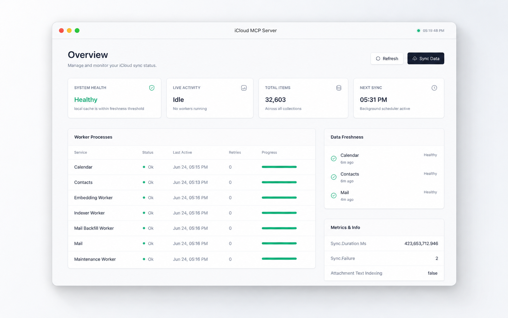

<div align="center">

# iCloud MCP Server

**Local-first MCP access to iCloud Mail, Calendar, and Contacts.**

[](https://github.com/denisdasilvarocha/icloud-mcp-server/actions/workflows/ci-cd.yml) [](https://www.python.org/) [](https://github.com/jlowin/fastmcp) [](https://docs.astral.sh/uv/) [](https://docs.astral.sh/ruff/) [](pyproject.toml)

[Features](#features) · [Setup](#setup) · [MCP Tools](#mcp-tools) · [Configuration](#configuration-variables) · [Development](#development)



</div>

<br />

`icloud-mcp-server` runs a local [FastMCP](https://github.com/jlowin/fastmcp) server that gives MCP clients access to iCloud Mail, Calendar, and Contacts.

It syncs your iCloud data into a local SQLite cache, then exposes MCP tools for search, list/view, sync status, metrics, dashboard controls, and Calendar create/update operations.

The server uses standard iCloud protocols:

| Service | Protocol |
| --- | --- |
| Mail | IMAP |
| Calendar | CalDAV |
| Contacts | CardDAV |

Most tools are read-only and operate from the local cache. The only tools that write back to iCloud are Calendar create/update tools.

> [!IMPORTANT]
> Use an Apple app-specific password. Do **not** use your Apple ID account password.
>
> Create one at https://account.apple.com/.

## Features

- **Local-first access** to iCloud Mail, Calendar, and Contacts through a SQLite cache.
- **Unified search** across Mail, Calendar, and Contacts, plus domain-specific search tools.
- **Advanced query support** with FTS, semantic fallback, snippets, answer hints, signed cursors, and date/person/domain filters.
- **Mail, Calendar, and Contacts tools** for list, search, and view operations.
- **Background and manual sync** over IMAP, CalDAV, and CardDAV.
- **Sync resilience** with checkpoints, retry/backoff state, freshness reports, and cleanup.
- **Guarded Calendar writes** with validation, idempotent create requests, ETag conflict checks, audit events, and CalDAV persistence.
- **Local dashboard** for sync health, worker state, cache counts, metrics, and runtime configuration.
- **One-script MCP client setup** for Codex, Claude Code, Hermes Agent, and Docker Compose.
- **Local safety defaults** including app-specific password support, OS keychain fallback, redacted errors, and loopback-only dashboard binding.

## MCP Tools

### Search

| Tool | Purpose |
| --- | --- |
| `icloud.search` | Search Mail, Calendar, and Contacts together |
| `icloud.mail.search` | Search cached Mail |
| `icloud.calendar.search_events` | Search cached Calendar events |

### Mail

| Tool | Purpose |
| --- | --- |
| `icloud.mail.list` | List mail rows from the local cache |
| `icloud.mail.view` | View one cached mail message |

### Contacts

| Tool | Purpose |
| --- | --- |
| `icloud.contacts.list` | List contact rows |
| `icloud.contacts.search` | Search contacts by local aliases/indexes |
| `icloud.contacts.view` | View one cached contact |

### Calendar

| Tool | Purpose |
| --- | --- |
| `icloud.calendar.list_calendars` | List known calendars |
| `icloud.calendar.list_events` | List cached events by time range |
| `icloud.calendar.view_event` | View one cached event |
| `icloud.calendar.create_event` | Create a Calendar event after validation |
| `icloud.calendar.update_event` | Update a non-recurring event or recurring series |

### Sync, Metrics, and Dashboard

| Tool | Purpose |
| --- | --- |
| `icloud.sync.status` | Report cache freshness and worker checkpoints |
| `icloud.sync.now` | Run one iCloud sync cycle |
| `icloud.metrics.snapshot` | Return local metrics |
| `icloud.dashboard.start` | Start the local dashboard |
| `icloud.dashboard.status` | Return dashboard runtime status |
| `icloud.dashboard.stop` | Stop the local dashboard |

> [!NOTE]
> To start the dashboard, ask your Agent:
>
> ```text
> Start the iCloud MCP server dashboard
> ```
>
> The tool returns a local dashboard URL with an access token.

## Setup

### Prerequisites

You need:

- Python 3.11+
- [`uv`](https://docs.astral.sh/uv/) or [`docker`](https://www.docker.com/)
- Apple ID with iCloud access
- Apple app-specific password from https://account.apple.com/

### Install

Clone the repository:

```bash
git clone https://github.com/denisdasilvarocha/icloud-mcp-server.git
cd icloud-mcp-server
```

Run the setup script:

```bash
./scripts/setup.sh
```

The setup script prompts for:

- MCP client target
- iCloud credentials (Apple ID & Apple app-specific password)
- Configuration scope
- Credential storage method
- Sync-on-start behavior

It then writes the MCP client configuration for the selected agent.

### Setup targets

| Target | Command |
| --- | --- |
| Interactive setup | `./scripts/setup.sh` |
| Codex | `./scripts/setup.sh codex` |
| Claude Code | `./scripts/setup.sh claude-code` |
| Hermes Agent | `./scripts/setup.sh hermes-agent` |
| Docker Compose | `./scripts/setup.sh docker` |

> [!NOTE]
> When keychain storage is enabled, setup stores only `ICLOUD_APPLE_ID` in the MCP client config. The app-specific password is read from the OS keychain.

## Docker Compose

Docker Compose is the recommended option when you want an isolated, always-on local server.

Build and Start the container:

```bash
./scripts/setup.sh docker
```

### Config

```json
{
  "mcpServers": {
    "icloud-mcp": {
      "type": "stdio",
      "command": "docker",
      "args": ["exec", "-i", "icloud-mcp-server", "icloud-mcp"]
    }
  }
}
```

## Configure Manually

The package exposes one stdio MCP entrypoint:

```bash
uv run icloud-mcp
```

#### Claude Code
Claude Code reads MCP servers from `.mcp.json` for project scope or `~/.claude.json` for user/local scope:

```json
{
  "mcpServers": {
    "icloud-mcp": {
      "type": "stdio",
      "command": "uv",
      "args": ["run", "--project", "/path/to/icloud-mcp-server", "icloud-mcp"],
      "env": {
        "ICLOUD_APPLE_ID": "you@example.com",
        "ICLOUD_MCP_SYNC_ON_START": "true"
      }
    }
  }
}
```
#### Codex
Codex reads MCP servers from `.codex/config.toml` for project scope or `~/.codex/config.toml` for user scope:

```toml
[mcp_servers.icloud-mcp]
command = "uv"
args = ["run", "--project", "/path/to/icloud-mcp-server", "icloud-mcp"]
cwd = "/path/to/icloud-mcp-server"
enabled = true
startup_timeout_sec = 30
tool_timeout_sec = 120

[mcp_servers.icloud-mcp.env]
ICLOUD_APPLE_ID = "you@example.com"
ICLOUD_MCP_SYNC_ON_START = "true"
```

#### Hermes Agent
Hermes Agent reads MCP servers from `.hermes/config.yaml` for project scope or `~/.hermes/config.yaml` for user scope:

```yaml
mcp_servers:
  icloud-mcp:
    command: "uv"
    args:
      - "run"
      - "--project"
      - "/path/to/icloud-mcp-server"
      - "icloud-mcp"
    env:
      ICLOUD_APPLE_ID: "${ICLOUD_APPLE_ID}"
      ICLOUD_MCP_SYNC_ON_START: "${ICLOUD_MCP_SYNC_ON_START}"
    enabled: true
    timeout: 120
    connect_timeout: 60
    tools:
      resources: true
      prompts: true
```

For Hermes Agent, put matching values in `.hermes/.env` or `~/.hermes/.env`:

```dotenv
ICLOUD_APPLE_ID="you@example.com"
ICLOUD_MCP_SYNC_ON_START="true"
```

When keychain storage is disabled or unavailable, also provide `ICLOUD_APP_PASSWORD` in the client `env` block or Hermes `.env` file:

```json
"ICLOUD_APP_PASSWORD": "aaaa-bbbb-cccc-dddd"
```

## Configuration Variables

Runtime settings are read from environment variables defined in your MCP server configuration.

| Variable | Default | Purpose |
| --- | --- | --- |
| `ICLOUD_APPLE_ID` | unset | Apple ID / iCloud email |
| `ICLOUD_APP_PASSWORD` | unset | App-specific password; optional when available through keychain |
| `ICLOUD_MCP_DATABASE_PATH` | `~/.local/share/icloud-mcp/icloud-mcp.sqlite3` | SQLite cache path |
| `ICLOUD_MCP_SYNC_ON_START` | `true` | Start background sync when the server starts |
| `ICLOUD_MCP_SYNC_INTERVAL_SECONDS` | `900` | Background sync interval |
| `ICLOUD_MCP_STALE_AFTER_SECONDS` | `86400` | Cache freshness threshold |
| `ICLOUD_MCP_MAIL_SYNC_DAYS` | `30` | Mail lookback window |
| `ICLOUD_MCP_MAIL_SYNC_LIMIT_PER_MAILBOX` | `250` | Mail sync cap per mailbox |
| `ICLOUD_MCP_CALENDAR_PAST_MONTHS` | `24` | Calendar past sync window |
| `ICLOUD_MCP_CALENDAR_FUTURE_MONTHS` | `36` | Calendar future sync window |
| `ICLOUD_MCP_MAIL_INDEX_BODY_CHARS` | `16000` | Mail body characters indexed for search |
| `ICLOUD_MCP_CURSOR_SECRET` | generated | Cursor signing secret |
| `ICLOUD_MCP_USE_KEYCHAIN` | `true` | Use OS keychain fallback for credentials |
| `ICLOUD_MCP_DASHBOARD_HOST` | `127.0.0.1` | Dashboard bind host |
| `ICLOUD_MCP_DASHBOARD_PUBLIC_HOST` | `127.0.0.1` | Hostname shown in dashboard URLs |
| `ICLOUD_MCP_DASHBOARD_PORT` | `8765` | First dashboard port to try |
| `ICLOUD_MCP_DASHBOARD_ALLOW_EXTERNAL_BIND` | `false` | Allow non-loopback dashboard bind host while keeping the public host loopback |
| `ICLOUD_MCP_ALLOW_UNREDACTED_DEBUG` | `false` | Allow unredacted debug errors |

> [!WARNING]
> `ICLOUD_MCP_ALLOW_UNREDACTED_DEBUG=true` may expose sensitive account details or iCloud response data in errors. Keep it disabled outside local debugging.

## Development

Install dependencies:

```bash
uv sync --extra dev
```

Run the server locally:

```bash
uv run icloud-mcp
```

Run unit tests:

```bash
uv run python -m unittest discover -s tests/unit
```

Lint and format:

```bash
uv run ruff check .
uv run ruff format .
```

## Structure

```text
src/icloud_mcp/
  mcp/          FastMCP server entrypoint and MCP boundary helpers
  mail/         IMAP sync, cache reads, and Mail tools
  calendar/     CalDAV sync, event cache, validation, and write service
  contacts/     CardDAV sync, contact cache, and Contacts tools
  search/       Query planning, FTS, snippets, and ranking
  sync/         Scheduler, worker checkpoints, delta helpers, sync tools
  dashboard/    Local HTTP dashboard runtime and lifecycle tools
  storage/      SQLite connection, schema, migrations, cache state
  platform/     Settings, secrets, metrics, audit, redaction, XML helpers

tests/
  unit/         Fast local contract and behavior tests
  integration/  Opt-in live iCloud smoke test

scripts/        Single MCP client setup script
```
